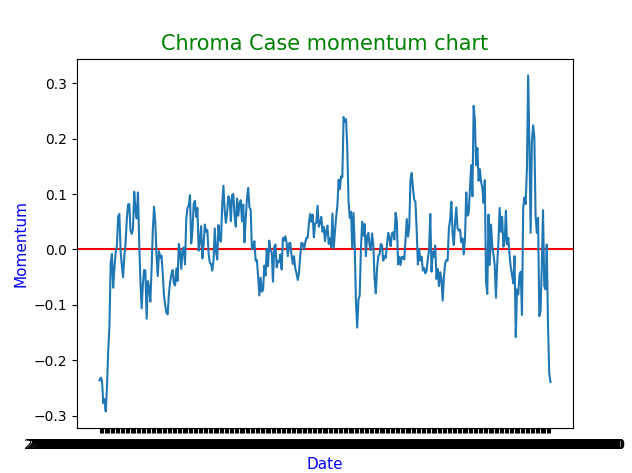

# Description

This software is a simple steam market CS:GO cases scraper in python3.

# Features

- Scrap a list of items
- Populate the list of CS:GO cases
- Scraped for each item
  - Volume
  - Sold last 24 hours
  - Ratio sell / volume
  - Item release date
  - Price history
  - Earn if the item was bought 5Y/3Y/2Y/1Y/6M/3M/1M/1W
  - Momentum at 5Y/3Y/2Y/1Y/6M/3M/1M/1W
  - Momentum history on the last year (10 days window)
- Save results in a json file
- Plot example

# Installation

1. Clone repo
   ```
   git clone https://github.com/fjourdren/CSGOCasesMarketScraper.git
   ```
2. Go in the project
   ```
   cd CSGOCasesMarketScraper
   ```
3. Connect to steam in a webbrowser https://steamcommunity.com/
4. Open developer console
5. Go in storage and copy the cookie "steamLoginSecure"'s content
6. Paste it in the "cookie.txt" file at the project root

## Create target items list

To create your to scrap items list, create the file "items_raw.json" and fill it like that:

```
python populate_items.py
```

or use the script which scrap the CS:GO cases list:

```
[
    {
        "market_hash_name": "Chroma Case"
    },
    ...
]
```

# Usage

## Generate CS:GO cases list

```
python populate_items.py
```

## Scrap items

```
python run.py
```

Results are stored in the file "items_results.json"

## Plot momentum example

```
python plot_momentum1Y.py
```


